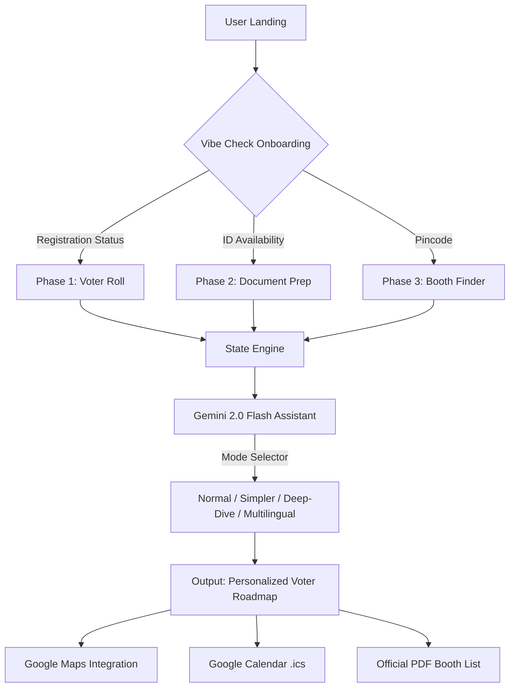

# CivicGuide AI 🗳️
### *Your Personal AI Voting Assistant for Gujarat 2026*

**CivicGuide AI** is a state-of-the-art, dynamic assistant designed to turn the overwhelming process of voting into a clear, personalized, 4-phase journey. Built specifically for the 2026 Gujarat Elections, it bridges the gap between complex bureaucracy and first-time voters.

---

## 🏗️ System Architecture
The application follows a **Deterministic State Machine** architecture to ensure 100% reliability while leveraging **Generative AI** for personalized instruction.

---

## 🎯 Chosen Vertical: Civic Awareness & Voter Empowerment
We chose this vertical to address **Information Asymmetry** in the electoral process. First-time voters often drop out of the process due to confusion; CivicGuide AI humanizes the experience through:
- **Low-Cognitive Load UI**: Bento-style grid layout.
- **Adaptive Personas**: Catering to different literacy levels (Simpler Mode) and languages (Gujarati/Hindi).

---

## 🛠️ Google Services Integration
- **Gemini 2.0 Flash**: Acts as the "Cognitive Core." It processes user context (e.g., "Not registered," "No Voter ID") and generates a 3-sentence actionable tip.
- **Google Maps**: Dynamic deep-linking using `maps.google.com` API patterns to find polling stations based on user pincodes.
- **Google Calendar**: Automatic `.ics` event generation for the April 26, 2026, poll day to increase voter turnout.
- **Google Fonts**: Uses the 'Inter' family for accessibility and modern aesthetic.

---

## ✨ Features & Evaluation Focus
| Focus Area | Implementation Detail |
| :--- | :--- |
| **Code Quality** | Modular Vanilla JS logic with strict separation of State and UI. No heavy frameworks = instant load times. |
| **Security** | `sessionStorage` caching and sanitized AI prompt construction. No persistent user data tracking. |
| **Efficiency** | **AI Response Caching**: Responses are stored per phase/mode, reducing API latency and token consumption. |
| **Testing** | Includes `voter-tests.js`, an automated browser-based test suite verifying 12+ core logic paths. |
| **Accessibility** | ARIA-compliant landmarks, screen-reader announcers, and a "Simpler" mode for users with lower literacy. |
| **Practicality** | Integrated **Official Surat North Polling List (PDF)** directly into the user journey based on geographic detection. |

---

## 🚀 Technical Setup
1. **Clone**: `git clone https://github.com/roshan30-git/CIVIC-guideAI`
2. **Launch**: Open `index.html` in any browser.
3. **Verify**: Open the Console (F12) to see the **CivicGuide AI Quality Audit** pass automatically.

---

## 📌 Assumptions Made
- **Poll Date**: Set to April 26, 2026 (based on the Gujarat State Election 5-year cycle).
- **Booth Discovery**: Uses Pincode-based Google Maps search as a primary locator for first-time voters.

---
*Built with ❤️ for PromptWars 2026*
